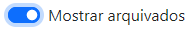
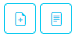
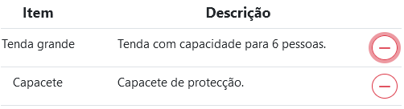
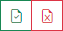
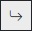
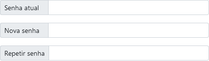
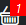
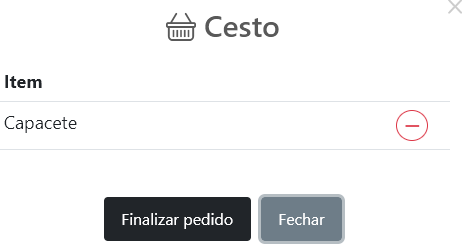

# :open_book: Manual de Utilizador

## :bookmark: Índice
* ### Primeiro arranque & Autenticação
    * [Registo e Inicio de Sessão](#registo-e-inicio-de-sessão)
    * [Terminar sessão](#terminar-sessao)
* ### Administração
    * [Utilizadores](#utilizadores)
    * [Secções e grupos](#secções-e-grupos)
    * [Cargos](#cargos)
    * [Material](#material)
    * [Categorias e tipos](#categorias-e-tipos-de-material)
    * [Emprestimos](#emprestimos)
* ### Utilizador
    * [Perfil](#perfil)
    * [Solicitar emprestimo](#solicitar-emprestimo)
    * [Consultar emprestimos](#consultar-emprestimos)

[2]:-
## :key: Primeiro Arranque & Autenticação
### Registo e Inicio de sessão

No primeiro arranque do backend é criado um utilizador com permissões de administração. Deverá iniciar sessão com esse utilizador e alterar o email e a senha através página de gestão de utilizadores.

Utilizador: `admin@1240.pt` e a senha: `escutas2021`.

Todos os campos solicitados no formulário de registo são de preenchimento obrigatório. O utilizador deverá indicar qual o grupo a que pertence. Caso os dados preenchidos estejam incorrectos, o administrador poderá alterá-los posteriormente.

### Terminar sessão
Aos findar a utilização da ferramenta deverá sempre terminar a sessão.

Na administração bastará clicar em Terminar sessão na no canto superior direito do ecrã.

Nas páginas de utilizador deverá abrir o menu  e clicar em Terminar sessão.
Caso tenha artigos no cesto estes serão apagados.

## :books: Administração
### Utilizadores

Esta página permite a gestão dos utilizadores.
Os resultados podem ser filtrados pelo grupo a que o utilizador pertence.

#### :pencil2: Criação e edição
Na criação ou edição, todos os campos são obrigatórios com excepção de Cargo.
Na página de edição teremos um botão para alterar senha  que permite repor uma nova senha a qaulquer utilizador que a tenha perdido.

#### :heavy_check_mark::no_entry: Acções e restrições
* É possível alterar qualquer utilizador.
* É possível eliminar qualquer utilizador há excepção do administrador criado por defeito no primeiro arranque. Esta acção é permanente e elimina o utilizador da base de dados no momento em que a acção é confirmada.
* Quando um utilizador é eliminado todo o seu histórico de emprestimos é também eliminado.

### Secções e grupos
Nesta página são listadas todas as secções existentes.
O botão 'Ver grupos'  reencaminha para a página grupos com o filtro da secção selecionada activado.
#### :pencil2: Criação e edição
Para criar uma secção bastará atribuir-lhe um nome e um código.
No caso dos grupos, para além do nome e código, será também necessário associá-lo a uma secção. 
O código de um grupo está dependente da secção a que está associado. Ex.:
Secção: Alcateia, código 1.
Grupo: Branco, código 1.
O código de grupo apresentado na lista será 11.

#### :heavy_check_mark::no_entry: Acções e restrições
* É possível alterar o nome ou código a qualquer secção ou grupo.
* Apenas é possível eliminar uma secção caso não existam grupos associados à mesma. Nesta situação todos os grupos associados terão de ser eliminados ou associados a outras secções para permitir eliminar a secção pretendida.
* Não é possível eliminar um grupo caso tenha utilizadores associados.
* Tanto ao criar como ao editar uma secção ou grupo não é permitido designar de um código já atribuido a uma secção existente.

### Cargos
A gestão de cargos é feita nesta página. Esta funcionalidade serve para atribuir cargos ou responsabilidades do agrupamento aos utilizadores. O cargo associado aos utilizadores será apresentado na página de listagem dos utilizadores existentes.

#### :pencil2: Criação e edição
Para criar um cargo bastará atribuir-lhe um nome.

#### :heavy_check_mark::no_entry: Acções e restrições
* Qualquer cargo é passivel de ser alterado ou eliminado.
* Os utilizadores que tinham um cargo eliminado atribuído passaram a ter a informação *Sem cargo* na listagem.

### Material
Nesta página é feita a gestão do material.
Por defeito, ao abrir a página são apresentados todos os artigos activos. Os resultados podem ser filtrados pela categoria a que pertencem.

É possível consultar todos os artigos em fim de vida arquivados através do switch . Esta lista serve para efeitos de arquivo de forma a poder-se identificar artigos que já não existem no histórico de emprestimos.

O código de cada artigo é gerado automaticamente. Os dois primeiros algarismos são o código do grupo responsável pelo artigo. O primeiro algarismo após o ponto representa a categoria em que o artigo está inserido. Os últimos dois algarismos representam o código do artigo em si. Este código do artigo é gerado automaticamente de forma incremental dependendo do número de artigos pertencentes ao grupo escolhido. O código é alterado posteriormente à sua criação caso se associe o artigo a um outro grupo. Ex.: `11.201`: 11 é o grupo, 2 é a categoria e 01 é o código do artigo.

#### :pencil2: Criação e edição
Ao criar um novo artigo é solicitado:
* Nome - obrigatório
* Descrição
* Data de compra do artigo - obrigatório
* Grupo responsável pelo artigo - obrigatório
* Categoria - obrigatório
* Tipo de material

Todos estes campos podem ser editados.

#### :heavy_check_mark::no_entry: Acções e restrições
* Podem ser criadas ou consultadas inspecções em qualquer artigo através dos botões . A data associada à inspecção será a data do momento em que a mesma é realizada.
* Qualquer artigo é passivel de ser alterado a qualquer momento desde que não esteja arquivado.
* O código de arquivo altera-se automaticamente caso se associe a um novo grupo responsável.
* Um artigo apenas poderá ser eliminado caso não esteja associado a nenhum emprestimo.
* Qualquer artigo poderá ser arquivado a qualquer momento, mesmo durante um emprestimo, através do botão . O mesmo não voltará a aparecer nos resultados na página de novos pedidos de emprestimo do utilizador.

### Categorias e Tipos de material
Nestas páginas são apresentadas as categorias e tipos de material existentes.

Nas categorias, o botão 'Ver tipos'  reencaminha para a página grupos com o filtro da secção selecionada activado.

Os 'tipos de material' são subcategorias de forma a identificar um artigo com maior precisão. São meramente informativos não tendo qualquer influência na geração do código de arquivo. Os tipos podem ser filtrados por categoria.

#### :pencil2: Criação e edição
Para criar uma categoria bastará atribuir-lhe um nome e um código.
No caso dos tipos, para além do nome e código, será também necessário associá-lo a uma categoria.

#### :heavy_check_mark::no_entry: Acções e restrições
* É possível alterar o nome ou código a qualquer categoria ou tipo de material.
* Apenas é possível eliminar uma categoria caso não existam tipos associados à mesma. Nesta situação todos os tipos associados terão de ser eliminados ou associados a outras categorias para poder ser elimindada.
* Não é possível eliminar um tipo caso tenha artigos associados.
* Tanto ao criar como ao editar uma categoria ou tipo não é permitido designar um código já atribuido a uma categoria ou tipo existentes.

### Emprestimos
Neste página são listados os emprestimos. Todos os emprestimos têm estados associados e podem ser filtrados por eles.

#### Estados:
* :hourglass: Pendente - é o estado padrão de qualquer pedido de emprestimo realizado por um utilizador.
* :heavy_check_mark: Aprovado - representa uma confirmação por parte do Administrador de que o emprestimo terá lugar.
* :x: Rejeitado - quando um emprestimo é não é autorizado pelo Administrador. Este é um estado final e imutável.
* :x: Cancelado - usado apenas pelos utilizadores caso já não desejem realizar o emprestimo. Este é um estado final e imutável.
* :arrow_forward: Em Curso - este estado deverá ser acionado aquando da entrega do material a quem realizou o pedido.
* :white_check_mark: Terminado - este estado é usado para representar a entrega do material emprestado e finalizar o emprestimo. Este é um estado final e imutável.

#### :pencil2: Criação e edição
Não é possível criar um emprestimo ou editar as datas de um emprestimo existente.

#### :heavy_check_mark::no_entry: Acções e restrições
* É possível remover artigos de emprestimos que estejam nos estados Pendentes e Aprovados recorrendo ao botão . Não é permitido fazê-lo em estados finais ou no decorrer de um emprestimo. Também não é possível remover artigos até ficar com um emprestimo vazio. Não será possível remover o último artigo presente na lista.

* A qualquer momento é possível visualizar o histórico de alterações de estado de um emprestimo.  

##### Botões de alteração de estado
*  Estes são os botões de acção quando o estado do emprestimo é Pendente. Botão de 'Aprovado' e botão de 'Não aprovado' respectivamente.
*  Este botão de acção é mostrado quando o emprestimo está aprovado. Ao ser carregado dará inicio ao emprestimo.
*  Este botão de acção é mostrado quando o emprestimo está em curso. Quando accionado finaliza o emprestimo e arquiva-o.

## :standing_person::standing_woman: Utilizador
### Perfil
Esta página de perfil é acessivel através do menu  e escolhendo a opção Editar Informações. 

#### :pencil2: Edição
O utilizador pode editar os seus dados ou alterar a sua senha. Os campos email e cargo são imutaveis. O campo cargo apenas pode ser editado por um administrador.

Para alterar a senha será necessário introduzir a sua senha actual para confirmar-se que é o próprio que pertende alterar a senha.

### Solicitar emprestimo
Nesta página serão apresentados ao utilizador os artigos disponíveis para emprestimo.

#### :date: Escolher data
Deverá começar o pedido por selecionar um intervalo de datas. Caso o emprestimo comece e termine no mesmo dia deverá selecionar a opção  antes de selecionar uma data.

#### :shopping_cart: Selecção de artigos & cesto
Após a data escolhida serão apresentados todos os artigos disponiveis durante esse periodo.
Todos os artigos associados a um emprestimo nos estados pendente, aprovado e em curso no intervalo de datas selecionado não serão listados.
Os artigos poderão ser filtrados pela categoria.

Para adicionar um artigo ao cesto deverá carregar no botão . O artigo desaparecerá da lista e é adicionado ao cesto. 

Os artigos adicionados ao cesto podem ser visualizados através do botão .

Os artigos poderão ser retirados do cesto e voltarão a aparecer na lista de artigos disponíveis.

Só é possível finalizar um pedido de encomenda caso o cesto tenha pelo menos um artigo adicionado.
Após finalizar a encomenda será reencaminhado para a página de consulta de emprestimos e o emprestimo mais recente aparecerá no topo da lista com o estado pendente.

### Consultar emprestimos
Aqui serão listados todas as solicitações de empresto realizadas pelo utilizador.
Os artigos mais recentes aparecem no topo e podem ser filtrados por estados.

#### :heavy_check_mark::no_entry: Acções e restrições
*  Um pedido pode ser cancelado a qualquer momento pelo utilizador deste que o pedido esteja Pendete ou Aprovado. O utilizador deverá expor a razão na caixa de texto.
*  Mostra todos os artigos pertencentes ao emprestimo. Não existe a possibilidade de alterar a lista após finalização do pedido.
*  Mostra o histórico de estados e respectivos comentários adicionados pelo administrador.

