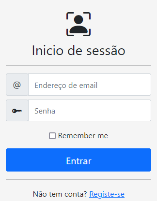

## Manual de Utilizador

### Indice
* #### Primeiro arranque
    * [Registo e Inicio de Sessão][2]
* #### Administração
    * [Utilizadores][3]
    * [Secções e grupos][4]
    * [Cargos][5]
    * [Material][6]
    * [Categorias e tipos][7]
    * [Emprestimos][8]
* #### Utilizador
    * [Pedir emprestimo][9]
    * [Ver emprestimos][10]
    * [Perfil][11]

### Primeiro Arranque
[2]: #### Registo e Inicio de sessão

No primeiro arranque do backend é criado um utilizador com permissões de administração. Deverá iniciar sessão com esse utilizador e alterar o email e a senha através página de gestão de utilizadores.

Utilizador: `admin@1240.pt` e a senha: `escutas2021`.

Todos os campos solicitados no formulário de registo são de preenchimento obrigatório. O utilizador deverá indicar qual o grupo a que pertence. Caso os dados preenchidos estejam incorrectos, o administrador poderá alterá-los posteriormente.

### Administração
[3]: #### Utilizadores

Esta página permite a gestão dos utilizadores.
Os resultados podem ser filtrados pelo grupo a que o utilizador pertence.

##### Criação e edição
Na criação ou edição, todos os campos são obrigatórios com excepção de Cargo.
Na página de edição teremos um botão para alterar senha  que permite repor uma nova senha a qaulquer utilizador que a tenha perdido.

##### Acções e restrições
* É possível alterar qualquer utilizador.
* É possível eliminar qualquer utilizador há excepção do administrador criado por defeito no primeiro arranque. Esta acção é permanente e elimina o utilizador da base de dados no momento em que a acção é confirmada.
* Quando um utilizador é eliminado todo o seu histórico de emprestimos é também eliminado.

[4]: #### Secções e grupos

Nesta página são listadas todas as secções existentes.
O botão 'Ver grupos'  reencaminha para a página grupos com o filtro da secção selecionada activado.
##### Criação e edição
Para criar uma secção bastará atribuir-lhe um nome e um código.
No caso dos grupos, para além do nome e código, será também necessário associá-lo a uma secção. 
O código de um grupo está dependente da secção a que está associado. Ex.:
Secção: Alcateia, código 1.
Grupo: Branco, código 1.
O código de grupo apresentado na lista será 11.

##### Acções e restrições
* É possível alterar o nome ou código a qualquer secção ou grupo.
* Apenas é possível eliminar uma secção caso não existam grupos associados à mesma. Nesta situação todos os grupos associados terão de ser eliminados ou associados a outras secções para permitir eliminar a secção pretendida.
* Não é possível eliminar um grupo caso tenha utilizadores associados.
* Tanto ao criar como ao editar uma secção ou grupo não é permitido designar de um código já atribuido a uma secção existente.

